# Tech World | Online Store for Smart Devices

Tech World is an e-commerce platform specializing in selling the latest smartphones, computers, and accessories. The platform provides a seamless shopping experience with secure payment options and fast delivery, making it the go-to destination for tech enthusiasts.

## Features
- Browse and purchase the latest tech gadgets.
- User-friendly interface with easy navigation.
- Secure payment methods.
- Admin panel for managing products, categories, and users.
- Responsive design for all devices.

## Screenshots
### User Interface
**Home Page**  
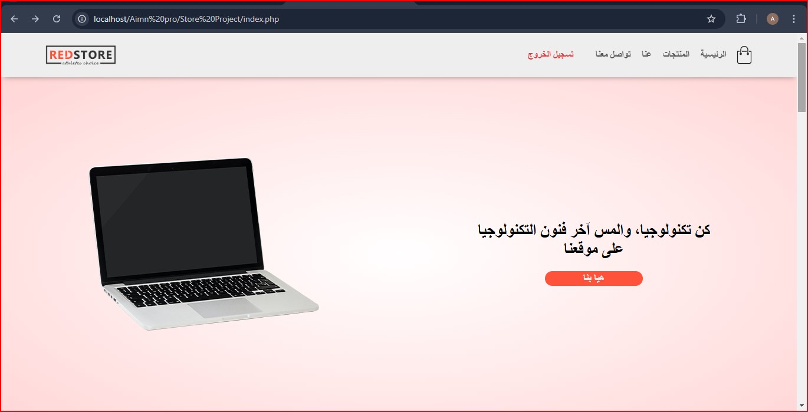

**All Products**  
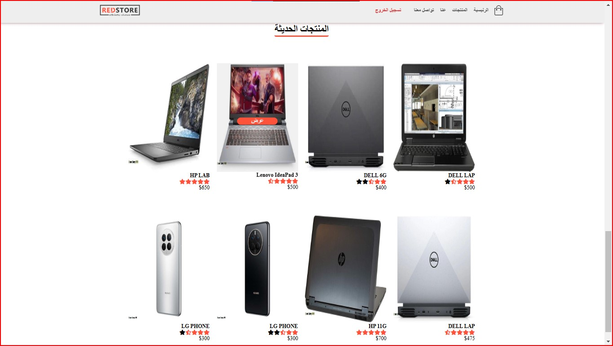

**Cart**  
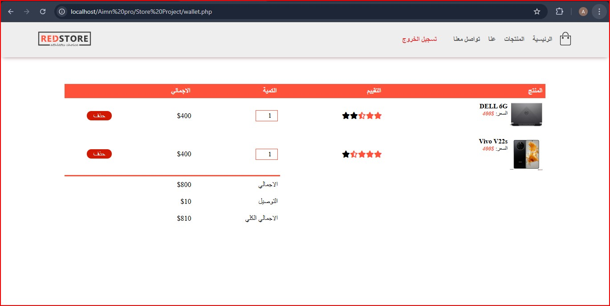

**Product Details**  
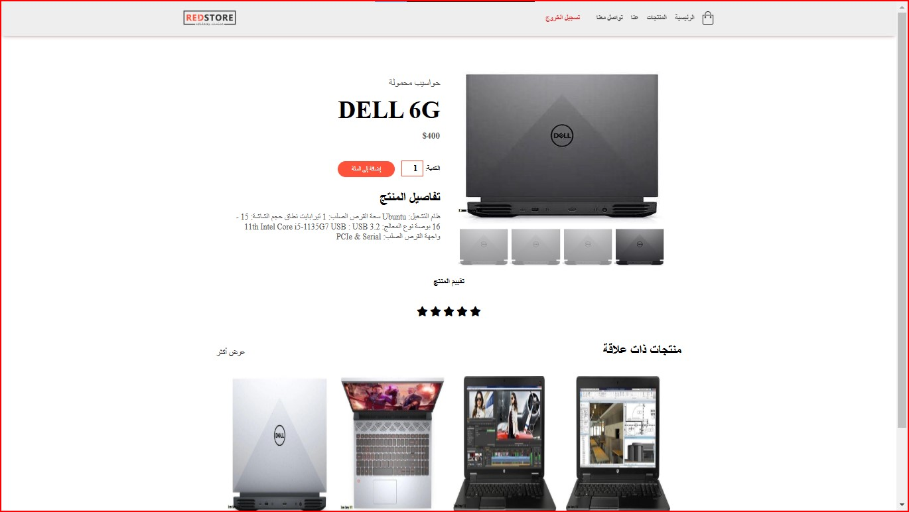

**Home Products**  
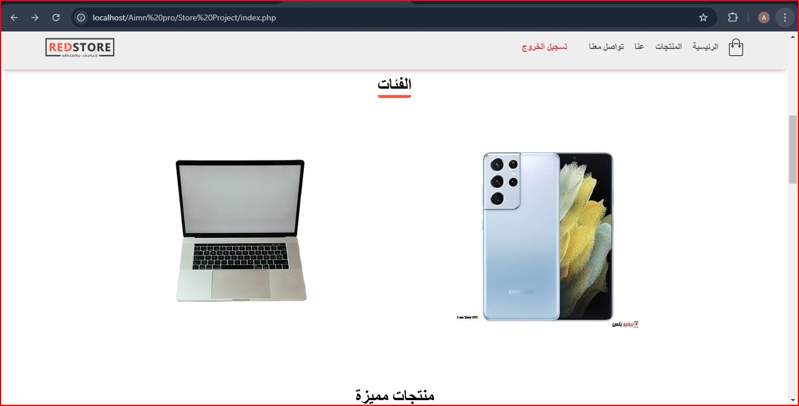

**Phone Products**  
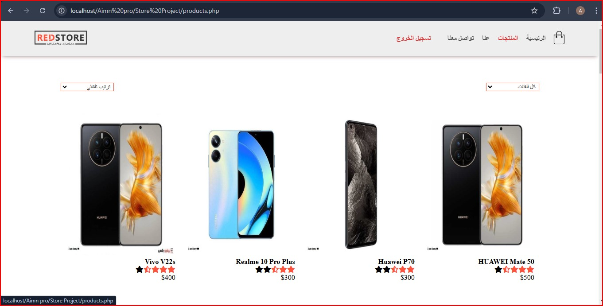

**All Categories**  
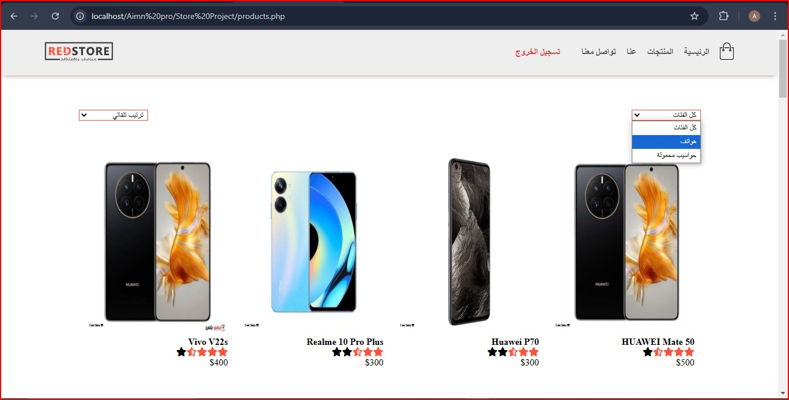

### Admin Panel
**Admin Dashboard**  
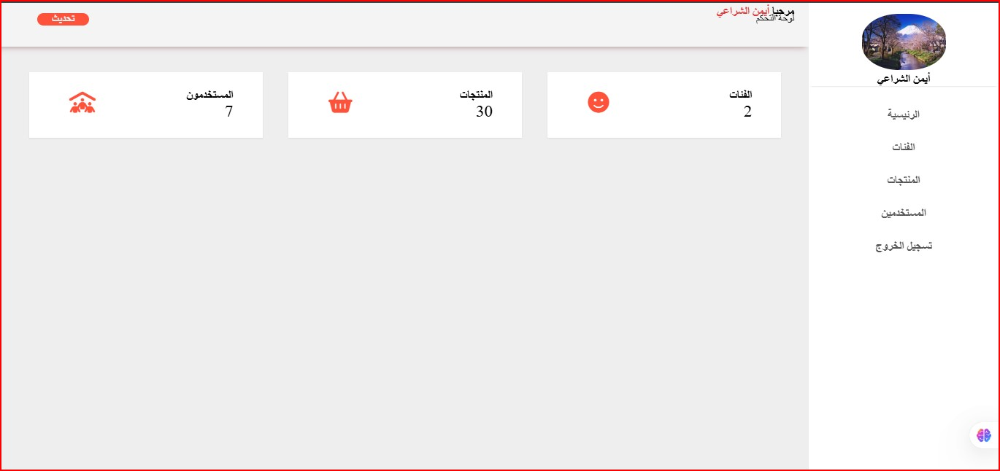

**Manage Categories**  
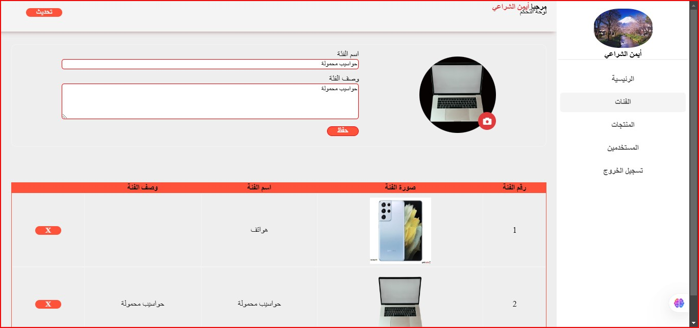

**Manage Products**  
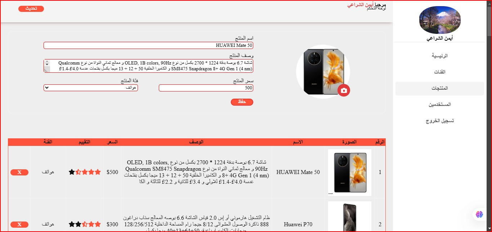

**Manage Users**  
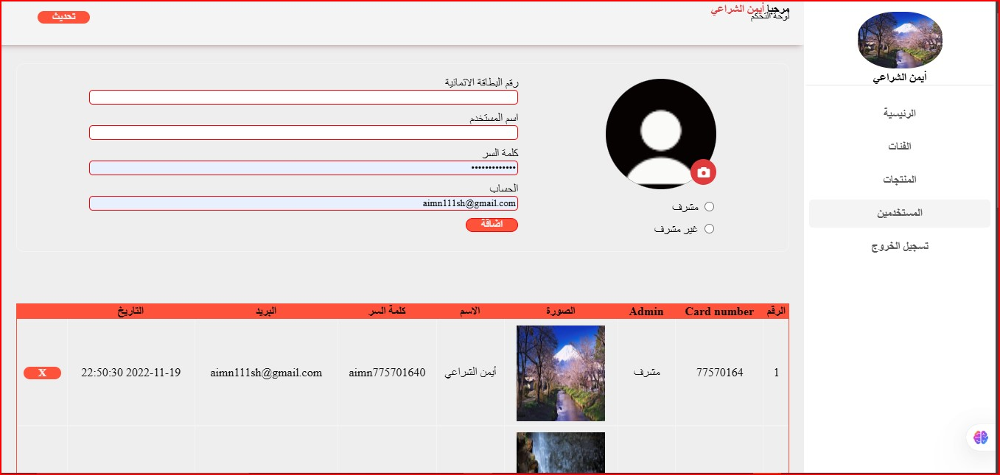

## Technologies Used
- HTML, CSS, JavaScript
- PHP, MySQL
- Laravel (if applicable)
- jQuery

## Status
**(Completed - Not Published)**

## Installation
1. Clone the repository:
   ```sh
   git clone https://github.com/AymanAlsharaei/Tech-World.git
   ```
2. Navigate to the project directory:
   ```sh
   cd Tech-World
   ```
3. Install dependencies:
   ```sh
   composer install
   npm install
   ```
4. Configure the database in `.env` file.
5. Run migrations:
   ```sh
   php artisan migrate --seed
   ```
6. Start the development server:
   ```sh
   php artisan serve
   ```

## License
This project is licensed under the MIT License.

---
**Author:** Ayman Alsharaei
